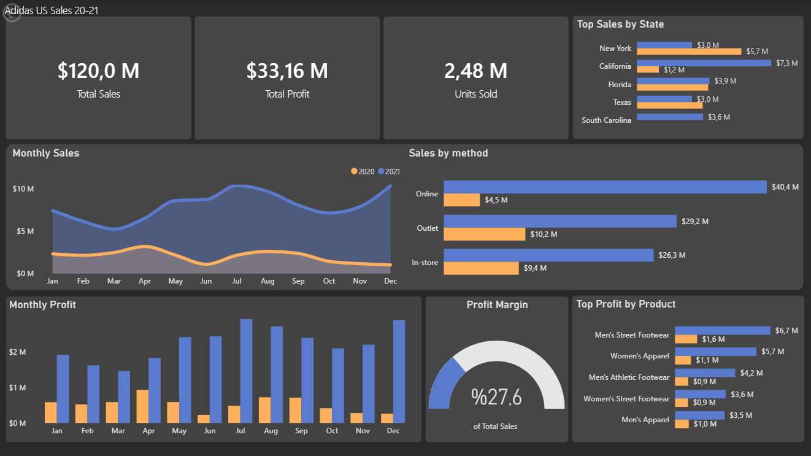
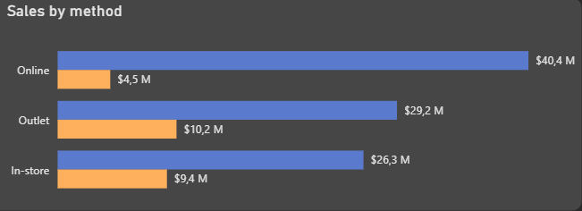
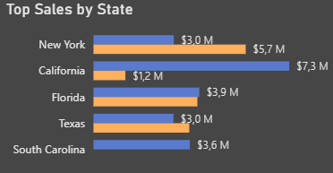
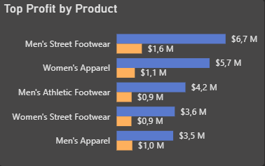

# Adidas US Sales Analizi (2020–2021): Satış, Kârlılık ve Kanal Performansı (Power BI)

Bu proje, **Adidas US Sales (2020–2021)** veri seti üzerinde Power BI kullanılarak hazırlanmış bir Business Intelligence (BI) çalışmasıdır.  
Amaç; satış performansını, kârlılığı ve kanallara göre (sales_method) davranışı analiz ederek aksiyon alınabilir içgörüler üretmektir.

---

## Canlı Dashboard / Dosya
**Power BI dosyası:** `Adidas_US_Sales.pbix`  

**Ekran Görüntüleri:** `screenshots/` klasöründe

---

## Kullanılan Araçlar
- Power BI Desktop (Modelleme, DAX, Görselleştirme)
- Power BI DAX (Time Intelligence, KPI ölçüleri)

---

## Proje Adımları

1. **Veri Modeli (Model View)**
   - `Date` tablosu oluşturuldu ve `invoice_date` ile ilişkilendirildi.
   - Ayların doğru sıralanması için `MonthNo` kullanıldı.

2. **DAX Ölçüleri (Measures)**
   - KPI ölçüleri (Sales, Profit, Units, Avg Price, Profit Margin)
   - Zaman analizleri: PM (Previous Month), MoM%, YTD

3. **Dashboard Tasarımı**
   - Dark tema ile okunabilirlik ve tutarlılık hedeflendi.
   - 2020/2021 kıyasları için renk standardı oluşturuldu.

---

## Veri Modeli (Özet)
- **Fact:** Adidas US Sales (satış kayıtları)
- **Dimension:** Date (zaman analizi), State/Region, Product, Retailer, Sales Method

> Amaç: KPI’lar + trend + kırılımlarla hem “ne oldu?” hem “neden oldu?” sorularını cevaplamak.

---

## Kullanılan DAX Ölçüleri (Özet)

### Core KPIs
- All Total Sales
- All Total Profit
- All Total Units
- Avg Price
- Profit Margin

### Time Intelligence
- Sales YTD / Profit YTD (yıl başından itibaren birikimli)
- Sales PM / Profit PM (önceki ay değeri)
- Sales MoM % / Profit MoM % (aydan aya değişim)

> Not: Veri 2020–2021 aralığında olduğundan kıyaslar ağırlıklı olarak MoM ve yıllar arası görsel karşılaştırma ile kurgulandı.

---

## Dashboard İçeriği (Sayfa Özeti)

### 1) KPI Şeridi
Genel performansı tek bakışta verir:
- Total Sales, Total Profit, Total Units

### 2) Top Sales by State
- En yüksek satış yapan eyaletler
- 2020–2021 kıyas okunabilir şekilde

### 3) Monthly Sales Trend
- Aylık satış trendi (2020/2021 kıyas)
- Tooltips ile ek metrikler (PM, MoM%, YTD)

### 4) Sales by Method (2020 vs 2021)
- Satış kanallarına göre kırılım
- “Hangi kanal büyüdü / hangisi düştü?” sorusuna cevap

### 5) Monthly Profit
- Kârlılık trendi sütunlarla

### 6) Total Profit by Product
- Kâra en çok katkı veren ürünlerin görünümü

---

## Görseller

